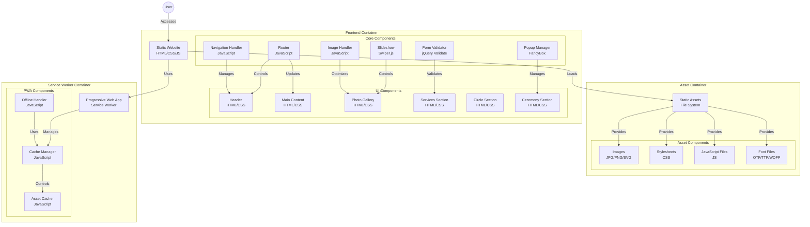



**Terapeuta Holistca
Lisbeth Rangel**
====================
Considero que el Ser humano es una UNIDAD entre cuerpo mente y espíritu y la salud es la armonía en esa unidad.

[Hablemos](https://wa.me/+5491170444296?text=Hola%20Lisbeth,%20quisiera%20mas%20informacion%20repecto%20a%20los%20temas%20de%20tu%20sitio%20web)
### **MI LIBRO VOLVER A LA TIERRA**
En esta época de la humanidad estamos acompañados por el resurgir de la conexión con la Madre Tierra en todos sus niveles. Los antiguos dejaron testimonio de un tiempo en el que concluiría una etapa, una forma de vivir la vida y lo que ella conlleva; que al mismo tiempo vislumbra el umbral hacia nuevos modelos. Ahora nos encontramos en esa transición de vuelta a casa. 

Volver a lo sencillo, con la medicina de lo ya transitado que nos da los cimientos para construir algo completamente nuevo. Se está transformando la energía y somos nosotros "los esperados" para transfigurar la historia. La reconexión con lo femenino consciente en hombres y mujeres está reverberando en cada célula del planeta para recobrar el tan necesario equilibrio compuesto de sus cualidades:

1. Amor
1. compasión
1. paz
1. sabiduría...

[Puedes conseguir mi libro aqui.](https://play.google.com/store/books/details?id=Z03kEAAAQBAJ&gl=ar)

## **Mi Biografía**

### **Esencia**
Soy un ser humano que elige compartirse desde lo que ha hecho carne, desde el lugar más sagrado que reconoce, ese punto de luz en el centro del corazón. 

### **Compartir**
Hoy estoy en este espacio para poner al servicio de cada alma que resuene con mi medicina mi camino a lo largo de 12 años, haciendo movimientos en él.
### **Inspiración**
Este espacio es iniciático en mi vida y a través de ella deseo llegar a sus corazones para contarles que la vida es hermosa y que no siempre fue como es ahora. 
### **Terapeuta Holistca**
Cuando accedemos a nuestros cuerpos sutiles nos encontramos con una impresión de memorias e información que pueden ir desarmonizándonos, por ser de baja vibración y las mismas pueden ir ocasionando expresiones en el cuerpo físico en forma de enfermedad.

